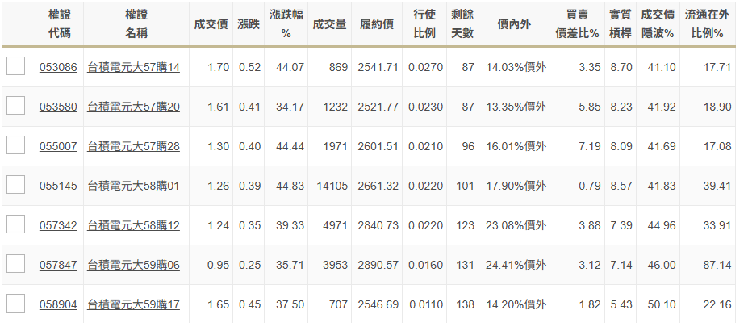

根據你提供的圖片數據以及我搜尋到的具體資料，我為你將這幾檔權證進行分類與分析。這幾檔雖然標的都是台積電（2330），但因為**履約價**與**剩餘天數**的不同，它們的性格完全不同。

### 1. 權證數據對比表（參考 2026 年 4 月市場資訊）

根據圖片中 **58購01** 的數據推算，台積電當時股價約落在 **$2,257** 附近。

| 權證名稱 | 代號 | 履約價 | 價內外程度 | 剩餘天數 | 實質槓桿 | 特性分析 |
| :--- | :--- | :--- | :--- | :--- | :--- | :--- |
| **56購42** | 050155 | 2,093.17 | **價內 (~7%)** | 約 70 天 | 較低 | **穩健型**：連動性強，受時間價值損失影響相對較小，適合波段持有。 |
| **56購50** | 050623 | 2,225.00 | **價平 (~1%)** | 約 74 天 | 中 | **平衡型**：最敏感的區間。台積電一漲，它就會立刻變價內並噴發。 |
| **58購01** | 055145 | 2,661.32 | **價外 (17.9%)** | 101 天 | **8.57** | **樂透型**：槓桿倍數高，但台積電要漲超過 22% 才開始有肉。 |
| **59購17** | 058904 | 2,546.69 | **價外 (14.2%)** | **138 天** | 5.43 | **長線型**：剩餘天數最長，時間價值流失較慢，容錯率較高。 |
| **56購46** | 050422 | 2,130.00 | **價內 (~5%)** | 約 68 天 | 較低 | **穩健型**：與 56購42 類似，屬於已經具備內含價值的權證。 |

---

### 2. 深度分析：你該選哪一檔？

#### A. 如果你預期台積電「短期內會大噴發」（例如法說會利多）
* **首選：58購01 (055145)**
* **理由：** 它的**實質槓桿最高 (8.57)**，且買賣價差比 (0.79) 極低，代表交易成本最低。雖然它是深度價外，但只要台積電短線漲 3-5%，這檔權證的漲幅會非常驚人。

#### B. 如果你預期台積電「會慢慢漲，想抱 1-2 個月」
* **首選：56購42 或 56購46**
* **理由：** 這兩檔已經進入**「價內」**。價內的權證就像是「打折的台積電現股」，它們的 Delta（連動性）很高，台積電漲 1 元，它們會跟得很緊，且時間價值的流失（Theta）對它們的影響比價外權證小。

#### C. 如果你想「給自己多一點時間等待」
* **首選：59購17 (058904)**
* **理由：** 它的**剩餘天數 (138 天)** 是這幾檔中最長的。權證最怕時間流逝，天數越長，你每天付出的「時間租金」就越少。

---

### 3. 從圖片中看出的關鍵陷阱 (Red Flags)

1.  **價差比過大：** 注意看圖片中的 **57購28 (055007)**，買賣價差比高達 **7.19**。這代表你買進後要先漲 7% 才能回本，這種權證千萬不要碰，這就是被券商「吃豆腐」。
2.  **流通在外比例：** **59購06 (057847)** 的流通比例高達 **87.14%**。這已經接近「快賣光了」的紅線。一旦超過 90%，券商可能不再掛賣單，價格會被散戶亂喊導致溢價，你想賣回給券商時，價格可能會不合理。

### 💡 總結建議
如果你是初次嘗試，**56購50** 或是 **56購42** 這種接近「價平」或「微價內」的權證，會讓你對股價跳動最有感，且風險相對樂透型的 58購01 低一點。